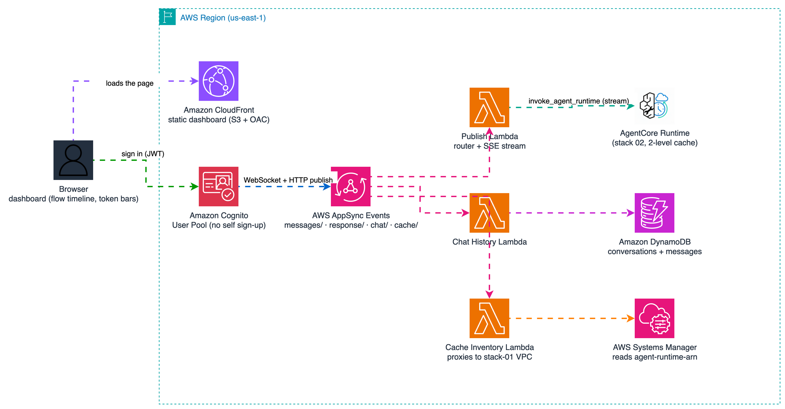

# 03: Production Website (AppSync Events + Cognito)

Secure, real-time web chat for the semantic-cache travel agent. Two CDK apps:
`backend/` (AppSync Events API, router Lambda, Cognito, DynamoDB chat history)
and `frontend/` (React app on S3 + CloudFront). Based on the AppSync
Event–Lambda primitive pattern.

## Architecture



Editable source: [images/diagram.drawio](./images/diagram.drawio)

Channel namespaces: `messages/` routes to the publish Lambda (EVENT), `response/`
streams answers back to the browser, `chat/` is the history API (REQUEST_RESPONSE),
and `cache/` serves the live cache inventory.

Security: no anonymous access. Cognito User Pool auth on the AppSync
namespaces, self-sign-up disabled (create users with `admin-create-user`),
scoped IAM per Lambda, S3 media bucket with expiring lifecycle.

## SSM contract

Reads: `/semantic-cache/agent-runtime-arn` (written by stack 02: the frontend
pins it in `VITE_AGENT_LIST`).
Writes: `/semantic-cache/appsync/{http_endpoint,realtime_endpoint,api_key}`,
`/semantic-cache/bucket/media_sessions`, `/semantic-cache/table/chat_messages`.

## Deploy (order matters: stacks 01 and 02 first)

```bash
# Backend
cd 03-production-website/backend
uv venv --python 3.13 .venv && source .venv/bin/activate
uv pip install -r requirements.txt boto3
cdk deploy

# Frontend (production dashboard): config comes from SSM automatically
cd ../frontend/dashboard
bash generate_config.sh       # reads SSM + backend stack, writes config.js
cd .. && uv venv --python 3.13 .venv && source .venv/bin/activate
uv pip install -r requirements.txt
cdk deploy SemanticCacheWebsiteStack
```

The dashboard is the production version of the stack-01 local app: Cognito
login, real-time chat over AppSync Events (WebSocket), per-answer cache badges
(cache hit / plan hint / tool cache hits / cycles), and per-session token bars
(consumed vs saved). The publish Lambda forwards the runtime's cache metrics
on the `complete` event so the charts show real numbers.

## Create a user (self-sign-up is disabled by design)

```bash
aws cognito-idp admin-create-user --user-pool-id <pool> --username <email> \
  --user-attributes Name=email,Value=<email> Name=email_verified,Value=true \
  --message-action SUPPRESS
aws cognito-idp admin-set-user-password --user-pool-id <pool> \
  --username <email> --password '<password>' --permanent
```

Then open the CloudFront URL from the frontend stack output and sign in.
