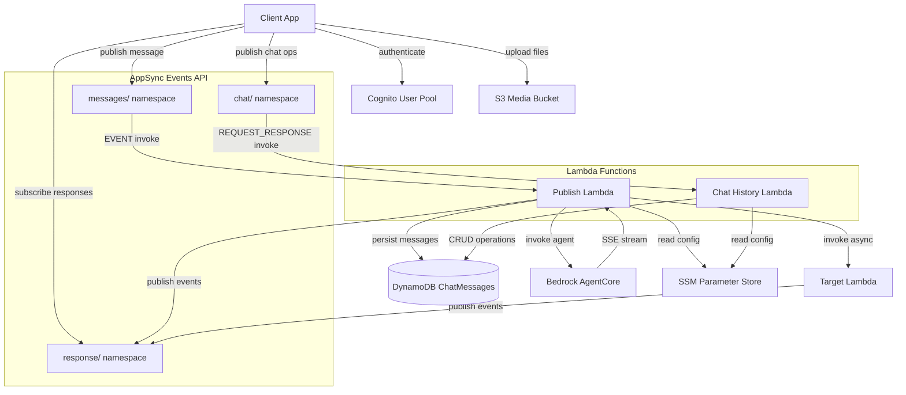

# AppSync Event Lambda Primitive

A CDK stack that provisions an AWS AppSync Events API with a Lambda router pattern and persistent chat history. Clients publish messages through real-time WebSocket channels; the router Lambda validates and routes them to either a target Lambda (async) or a Bedrock AgentCore runtime agent (synchronous streaming). Responses stream back through a dedicated response channel. Chat conversations and messages are persisted to DynamoDB for retrieval via a separate chat history channel.

## Architecture



## Project Structure

```
├── apis/
│   └── events_api.py                          # EventsAPI construct (API key + optional Cognito auth)
├── appsync_event_lambda_primitive/
│   └── appsync_event_lambda_primitive_stack.py # Main CDK stack
├── databases/
│   └── databases.py                           # Tables construct (DynamoDB ChatMessages table)
├── lambdas/
│   ├── project_lambdas.py                     # Lambdas construct (publish + chat_history)
│   └── code/
│       ├── publish/                           # Router Lambda
│       │   ├── lambda_function.py             # Handler + AgentCoreStreamProcessor
│       │   ├── agent_core_service.py          # AgentCore runtime client + SSE reader
│       │   ├── appsync_service.py             # AppSync HTTP publish client
│       │   ├── chat_persistence_service.py    # Fire-and-forget DynamoDB persistence
│       │   ├── config_service.py              # SSM parameter retrieval helper
│       │   └── invocation_service.py          # boto3 Lambda invoke wrapper
│       └── chat_history/                      # Chat History Lambda
│           ├── lambda_function.py             # CRUD action router
│           ├── chat_history_service.py        # DynamoDB CRUD operations
│           └── config_service.py              # SSM parameter retrieval helper
├── tests/unit/                                # Unit + property-based tests
├── config.py                                  # SSM param names, Cognito config, constants
├── app.py                                     # CDK app entry point
└── cdk.json                                   # CDK configuration
```

## Prerequisites

- Python 3.13+
- AWS CDK CLI (`npm install -g aws-cdk`)
- AWS credentials configured (`aws configure`)
- An existing Cognito User Pool (optional: set `COGNITO_USER_POOL_ID = None` in `config.py` to disable)

## How It Works

### Channel Namespaces

| Namespace | Handler | Invoke Type | Purpose |
|-----------|---------|-------------|---------|
| `messages/` | Publish Lambda | EVENT | Send messages to agents or target Lambdas |
| `response/` | None (passthrough) |: | Receive streaming responses |
| `chat/` | Chat History Lambda | REQUEST_RESPONSE | CRUD operations on chat history |

### Message Routing (Publish Lambda)

The publish Lambda routes based on the payload:

- **`agent_arn` present** → Invokes Bedrock AgentCore runtime (sync streaming). The `AgentCoreStreamProcessor` filters raw SSE events and publishes typed events (`tool_call`, `tool_result`, `message`, `complete`, `error`) to the response channel.
- **`target_arn` present** → Invokes the target Lambda asynchronously. The target Lambda publishes responses directly to the response channel.
- **`agent_arn` takes precedence** when both are present.

### Chat Persistence

When a message includes `conversation_id` and `user_id`, the publish Lambda automatically:

1. Creates the conversation metadata if it doesn't exist
2. Saves the user message before routing
3. Saves all intermediate agent events (tool calls, tool results, intermediate messages)
4. Saves the final assistant response after the stream completes

Persistence is fire-and-forget: failures are logged but never block the real-time message flow.

### Chat History (Chat History Lambda)

The `chat/` channel supports these actions:

| Action | Required Params | Description |
|--------|----------------|-------------|
| `list_conversations` | `user_id` | List user's conversations (most recent first) |
| `get_messages` | `user_id`, `conversation_id` | Get messages in a conversation (chronological) |
| `create_conversation` | `user_id` | Create a new conversation |
| `delete_conversation` | `user_id`, `conversation_id` | Delete conversation and all messages |
| `update_conversation` | `user_id`, `conversation_id`, `title` | Update conversation title |
| `auto_rename_conversation` | `user_id`, `conversation_id` | Generate a title from the dialogue with a Bedrock model and persist it |

All list/get operations support pagination via `limit` and `next_token`.

#### Auto-rename

`auto_rename_conversation` powers an "Auto-rename" button in the web app. It reads the
conversation's user/assistant turns, asks a Bedrock model (via the Converse API) for a
short relevant title, persists it to the `title` attribute, and returns it synchronously:

```jsonc
// publish to the "chat" channel
{
  "action": "auto_rename_conversation",
  "user_id": "<cognito-sub>",
  "conversation_id": "<uuid>"
}
// response payload
{ "statusCode": 200, "conversation_id": "<uuid>", "title": "Centering a div with flexbox", "updated_at": "..." }
```

The model is configured by the `TITLE_MODEL_ID` env var on the chat history Lambda
(default `global.anthropic.claude-haiku-4-5-20251001-v1:0`, set from `TITLE_MODEL_ID` in `config.py`). Any
Bedrock model or inference profile that supports the Converse API works. The Lambda is
granted `bedrock:InvokeModel` for this. Errors: `404` if the conversation isn't found,
`400` if it has no dialogue yet.

### Response Channel Format

```
response/{original_channel_path}/{event_id}
```

Example: publishing to `messages/default` produces responses on `response/messages/default/{event_id}`.

### Selective Stream Yield

The AgentCore path uses a stateful stream processor that filters raw SSE events and publishes only structured event types:

| Type | Shape | When |
|------|-------|------|
| `tool_call` | `{"type": "tool_call", "tool": name, "toolUseId": id, "input": {...}}` | Agent invokes a tool |
| `tool_result` | `{"type": "tool_result", "tool": name, "toolUseId": id, "result": preview}` | Tool returns (truncated to 500 chars) |
| `message` | `{"type": "message", "content": text}` | Agent reasoning cycle text |
| `complete` | `{"type": "complete", "answer": text}` | Final answer |
| `error` | `{"type": "error", "error": text}` | Error during invocation |

### DynamoDB Single-Table Design

The ChatMessages table uses composite keys for all access patterns:

| Access Pattern | PK | SK |
|----------------|----|----|
| List conversations | `USER#{user_id}` | `CONV#{conversation_id}` |
| Get messages | `CONV#{conversation_id}` | `MSG#{timestamp}#{message_id}` |
| Conversation metadata | `USER#{user_id}` | `CONV#{conversation_id}` |

## Key Code Snippets

### Stack Wiring

The main stack delegates to focused methods:

```python
def __init__(self, scope, construct_id, cognito_user_pool_id=None, **kwargs):
    super().__init__(scope, construct_id, **kwargs)
    self.create_resources()      # Instantiate all constructs
    self.set_up_identity_pool()  # Cognito Identity Pool (if enabled)
    self.set_up_env_vars()       # SSM param names as env vars
    self.create_parameters()     # Write SSM parameters
    self.set_up_permissions()    # IAM grants
```

Channel namespaces are wired in `create_resources()`:

```python
self.events_api.add_channel_namespace(
    "messages", publish=self.lambdas.publish, pub_invoke_type="EVENT"
)
self.events_api.add_channel_namespace("response")
self.events_api.add_channel_namespace(
    "chat", publish=self.lambdas.chat_history, pub_invoke_type="REQUEST_RESPONSE"
)
```

### SSM Parameter Resolution at Runtime

Lambda functions receive SSM parameter names as environment variables and resolve values at cold start:

```python
# config_service.py - shared across all Lambdas
import boto3

ssm_client = boto3.client("ssm")

def get_ssm_parameter(parameter_name):
    if not parameter_name:
        raise ValueError("Parameter name must not be empty")
    response = ssm_client.get_parameter(Name=parameter_name, WithDecryption=True)
    return response["Parameter"]["Value"]
```

### Chat History Lambda: AppSync Events Response Format

The chat history Lambda returns responses in AppSync Events direct integration format:

```python
def _success_response(event_id, result):
    return {
        "events": [{
            "id": event_id,
            "payload": {"statusCode": 200, **result},
        }]
    }
```

## Authentication

The AppSync Events API always enables API key auth. Cognito User Pool auth is added when `COGNITO_USER_POOL_ID` is set in `config.py`.

When Cognito is enabled the stack also creates:

- A **User Pool web client** (no secret) for browser-based auth
- A **Cognito Identity Pool** with unauthenticated access disabled
- An **authenticated IAM role** granting S3 access and SSM parameter reads

## SSM Parameters

| Parameter | Value |
|-----------|-------|
| `/appsync/http_endpoint` | AppSync HTTP DNS |
| `/appsync/realtime_endpoint` | AppSync Realtime DNS |
| `/appsync/api_key` | AppSync API key |
| `/bucket/media_sessions` | S3 bucket name |
| `/table/chat_messages` | DynamoDB table name |
| `/auth/identity_pool_id` | Cognito Identity Pool ID (when Cognito enabled) |
| `/auth/web_client_id` | Cognito User Pool web client ID (when Cognito enabled) |

See `config.py` for the full list of parameter name constants.

## Setup

```bash
python3 -m venv .venv
source .venv/bin/activate
pip install -r requirements.txt
```

## Configuration

Edit `config.py` to set your Cognito User Pool ID:

```python
# Set to your existing Cognito User Pool ID to enable dual auth + identity pool
# Set to None to disable Cognito and use API key auth only
COGNITO_USER_POOL_ID = "us-east-1_aBcDeFgHi"
```

## Deploy

```bash
cdk deploy
```

## Testing

```bash
pip install -r requirements-dev.txt
pytest tests/unit/ -v
```

Tests use `unittest.mock` to mock AWS services (DynamoDB, SSM, Lambda). Lambda modules are imported via `importlib.util` to avoid module name conflicts. Test files are organized by component:

| Test File | Covers |
|-----------|--------|
| `test_publish_lambda.py` | Routing, validation, persistence integration |
| `test_chat_history_lambda.py` | Action routing, error handling |
| `test_chat_history_service.py` | CRUD operations, pagination |
| `test_chat_persistence_service.py` | Message persistence, failure handling |
| `test_appsync_event_lambda_primitive_stack.py` | CDK template assertions |
