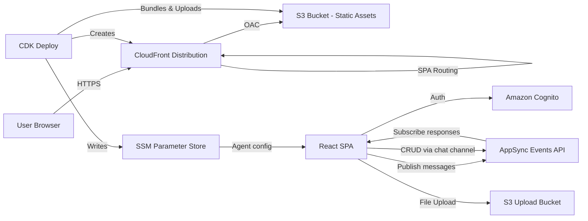

# AI Agent Website

An AWS CDK Python project that deploys a React-based AI agent chat application to AWS, served globally via CloudFront with S3 origin and Origin Access Control (OAC). The CDK stack name is **AI-AGENT-WEB**.

## Architecture Overview



## Features

- **Real-time chat** via AWS AppSync Events API with streaming responses
- **Chat persistence** — conversations and messages stored in the backend via AppSync Events CRUD operations on the `chat/` channel
- **Cognito authentication** with force-change-password flow support
- **Multi-agent support** — agents loaded dynamically from SSM Parameter Store, with `disabled` flag filtering
- **Model selector** — switch between AI models from the chat sidebar
- **File uploads** — drag-and-drop or click to attach images, PDFs, Office docs, CSV, and more
- **Formatted copy** — copy assistant messages as markdown or rich formatted text (HTML) for pasting into Google Docs, Notion, Slack
- **Mermaid diagram rendering** — fenced mermaid code blocks render as interactive SVG diagrams
- **Optimistic UI** — create, rename, and delete conversations with instant feedback and rollback on failure
- **Pagination** — cursor-based pagination for conversations and messages via `next_token`
- **User-isolated channels** — messages publish to `messages/{user_id}/{conversation_id}`, responses arrive on `response/messages/{user_id}/*`
- **Responsive layout** — chat area scales to use available screen width

## Project Structure

```
.
├── app.py                              # CDK app entry point
├── config.py                           # Centralized constants and SSM parameter names
├── deploy-website.sh                   # Build + deploy in one step
│
├── ai_agent_website_primitive/         # Main CDK stack
│   └── ai_agent_website_primitive_stack.py
│
├── webhosting/                         # CDK construct: S3 + CloudFront + S3Deploy
│   └── web_hosting.py
│
├── ai-agent-frontend/                  # React SPA (Vite + Tailwind + shadcn/ui)
│   ├── src/
│   │   ├── main.tsx                    # App entry point
│   │   └── app/
│   │       ├── App.tsx                 # Root component (RouterProvider)
│   │       ├── routes.tsx              # Route definitions (/, /login, /chat)
│   │       ├── pages/                  # Page components (Root, Login, Chat)
│   │       ├── components/             # Shared components + shadcn/ui primitives
│   │       ├── config/                 # Agent, Cognito, model, upload configs
│   │       ├── context/                # AuthContext, AgentContext, ModelContext
│   │       ├── hooks/                  # useAppSyncChat (messaging + subscriptions)
│   │       ├── services/               # chatService, appSyncEventsService, uploadService
│   │       └── utils/                  # Message extraction, markdown-to-HTML, clipboard
│   ├── package.json
│   └── vitest.config.ts
│
├── tests/unit/                         # Python/CDK unit tests
│   ├── test_config.py
│   └── test_web_hosting_stack.py
│
└── .kiro/
    ├── specs/                          # Feature and bugfix specs
    └── steering/                       # Steering docs
```

## Prerequisites

- **Python 3.x** with `pip`
- **Node.js** with `pnpm`
- **AWS CDK CLI** (`npm install -g aws-cdk`)
- **AWS CLI** configured with appropriate credentials

## Deployment

```bash
# Set up Python environment
python3 -m venv .venv
source .venv/bin/activate
pip install -r requirements.txt

# Deploy everything (builds frontend + deploys CDK stack)
./deploy-website.sh
```

Or deploy manually:

```bash
cd ai-agent-frontend
pnpm install
pnpm build
cd ..

source .venv/bin/activate
cdk deploy AI-AGENT-WEB
```

After deployment, the website is accessible at the CloudFront distribution URL output by the stack.

## Key Code Snippets

### Main Stack Wiring

The stack delegates to focused methods — `create_resources()` instantiates constructs and `create_parameters()` writes SSM parameters:

```python
class AiAgentWebsitePrimitiveStack(Stack):
    def __init__(self, scope, construct_id, **kwargs):
        super().__init__(scope, construct_id, **kwargs)
        self.create_resources()
        self.create_parameters()

    def create_resources(self):
        self.web_hosting = WebHosting(self, "WebHosting")

    def create_parameters(self):
        ssm.StringParameter(self, "DistributionDomainParam",
            parameter_name=config.DISTRIBUTION_DOMAIN_PARAM_NAME,
            string_value=self.web_hosting.distribution_domain_name)
```

### Chat Service — CRUD via AppSync Events

The `ChatService` encapsulates conversation operations against the `chat/` channel using pub/sub with WebSocket subscriptions:

```typescript
export class ChatService {
  async listConversations(userId, limit?, nextToken?) {
    // Publishes {action: "list_conversations"} to chat/
    // Receives response via WebSocket subscription
  }
  async createConversation(userId, title?) { ... }
  async getMessages(userId, conversationId, limit?, nextToken?) { ... }
  async updateConversation(userId, conversationId, title) { ... }
  async deleteConversation(userId, conversationId) { ... }
}
```

### AppSync Events — Publish and Subscribe Pattern

The `publishWithResponse` method handles the AppSync Events pub/sub flow for request-response operations:

```typescript
async publishWithResponse(channel, payload, timeoutMs = 15000) {
  // 1. Open temporary WebSocket
  // 2. Subscribe to the channel
  // 3. After subscribe_success, publish via HTTP POST
  // 4. Wait for first data event (skip echoed requests)
  // 5. Clean up WebSocket and return parsed response
}
```

### Message Channel Isolation

Messages publish to user-specific channels for isolation:

```typescript
// Publish: messages/{user_id}/{conversation_id}
await service.publish(`/messages/${user.id}/${chatId}`, payload);

// Subscribe: response/messages/{user_id}/*
await subscribeTo(`response-${user.id}`, `/response/messages/${user.id}/*`, 'current');
```

## Testing

### CDK / Python Tests

```bash
source .venv/bin/activate
pytest tests/unit/
```

Tests use `unittest.mock` to patch `LocalBundler.try_bundle` (skipping real frontend builds) and CDK template assertions to verify the synthesized CloudFormation template.

### Frontend Tests

```bash
cd ai-agent-frontend
pnpm test
```

The frontend uses **Vitest** with **jsdom** environment and includes:
- **Property-based tests** (`fast-check`) validating serialization round-trips, UUID format, date conversion, conversation ordering, title derivation, pagination accumulation, and error status codes
- **Unit tests** for services (chatService, appSyncEventsService), utilities (clipboard, markdown-to-HTML), components (CopyFormatButton, ProtectedRoute, MessageRenderer), and configs
- **Date utility tests** for `formatConversationDate` and `getErrorMessage` helpers

## Configuration

SSM parameters created by the stack (see `config.py` for the full list):

| Parameter | Purpose |
|-----------|---------|
| `/cloudfront/distribution-domain` | CloudFront distribution domain name |
| `/cloudfront/distribution-id` | CloudFront distribution ID (for cache invalidation) |
| `/s3/site-bucket` | S3 bucket name hosting the frontend assets |

Additional parameters consumed by the frontend (created by other stacks):

| Parameter | Purpose |
|-----------|---------|
| `/agents/website` | JSON array of agent configurations (supports `disabled` flag) |
| `/models/website` | JSON array of available AI models |

## Frontend Environment Variables

The React app reads these from `.env` (local dev) or `.env.production`:

| Variable | Purpose |
|----------|---------|
| `VITE_COGNITO_USER_POOL_ID` | Cognito User Pool ID |
| `VITE_COGNITO_CLIENT_ID` | Cognito App Client ID |
| `VITE_COGNITO_REGION` | Cognito region |
| `VITE_COGNITO_IDENTITY_POOL_ID` | Cognito Identity Pool ID (for S3/SSM access) |
| `VITE_APPSYNC_EVENTS_ENDPOINT` | AppSync Events HTTP endpoint |
| `VITE_AGENT_LIST` | Fallback agent config JSON (used if SSM fetch fails) |
| `VITE_MODEL_LIST` | Model config JSON |
| `VITE_S3_UPLOAD_BUCKET` | S3 bucket for file uploads |

## Useful Commands

| Command | Description |
|---------|-------------|
| `cdk synth` | Synthesize the CloudFormation template |
| `cdk deploy AI-AGENT-WEB` | Deploy the stack |
| `cdk diff` | Compare deployed stack with current state |
| `cdk destroy` | Tear down the stack |
| `./deploy-website.sh` | Build frontend + deploy in one step |
