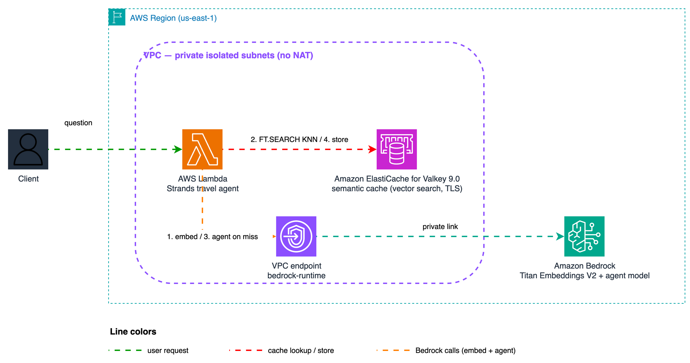
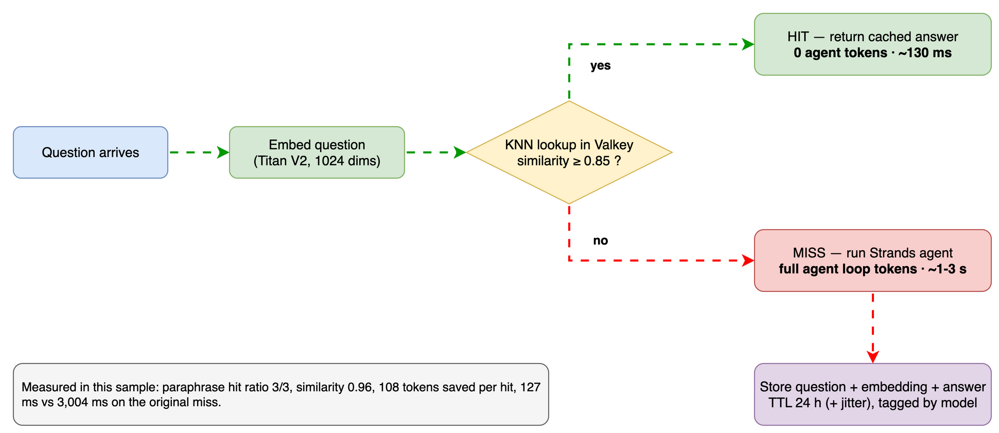

# Stop Paying for Repeated LLM Calls

Add a **semantic cache** to your AI agents with **Amazon ElastiCache for Valkey**:
when a user asks a question that is semantically similar to one already answered,
the cached answer is returned and the agent loop is skipped — **100% of that
invocation's LLM tokens are saved**. AWS's published benchmark for this pattern
reports up to [86% cost savings and 88% latency reduction](https://docs.aws.amazon.com/AmazonElastiCache/latest/dg/semantic-caching-overview.html).

> 💡 This sample uses Strands Agents. Semantic caching is a general agent
> pattern and carries over to other agent frameworks.

> ⚠️ This guide assumes familiarity with AWS CDK (Python) and Amazon Bedrock.

## The three levels of token savings

| Level | Mechanism | What it saves |
|---|---|---|
| 1. Prompt caching | Bedrock cache points (built into most frameworks) | Input-token cost on repeated prefixes; the response is still generated |
| 2. Conversation management | Sliding window / summarization | History tokens re-sent every turn |
| 3. **Semantic response cache** | **Demo 01** | **The entire invocation on a cache hit** |
| 4. **In-loop reasoning cache** | **Demo 02** | **Exploration cycles + tool executions on NEW questions that resemble past ones** |

## The two demos

| | Demo 01 — `travel_agent` | Demo 02 — `reasoning_agent` |
|---|---|---|
| Cache level | Before the agent (query-level) | Inside the agent loop (hooks) |
| Hits when | The same question is asked again (paraphrased) | A new question resembles a past one |
| What is saved | 100% of the invocation | Deliberation cycles + tool executions |
| Strands mechanism | Wrapper around the invocation | `BeforeInvocationEvent.messages` (plan hint) + `BeforeToolCallEvent.selected_tool` (tool swap) |
| Measured | 0 tokens, 127 ms on hits | 85% tokens, 85% cycles, 88% tool executions saved |

## Architecture



1. The incoming question is embedded (Titan Text Embeddings V2, 1024 dims).
2. `FT.SEARCH` runs a KNN lookup (HNSW, cosine) over previously answered questions,
   pre-filtered by model id.
3. Similarity ≥ threshold → **hit**: return the stored answer (no agent run).
4. Miss → the Strands agent answers; question + embedding + answer are stored with TTL.

### Cache flow (miss vs hit)



Full design rationale, failure modes, and cost notes: [docs/DESIGN.md](./docs/DESIGN.md).
Editable diagrams: [docs/architecture.drawio](./docs/architecture.drawio), [docs/cache-flow.drawio](./docs/cache-flow.drawio).

## Quick start

Prerequisites: AWS account with Bedrock model access (Claude + Titan Embeddings V2)
in `us-east-1`, [uv](https://docs.astral.sh/uv/), Node.js with the CDK CLI, Docker not required.

```bash
# 1. Build the Lambda dependencies layer (ARM64 / Python 3.13)
bash scripts/build_layer.sh

# 2. Deploy (ElastiCache takes ~15 minutes)
uv venv --python 3.13 .venv && source .venv/bin/activate
uv pip install -r requirements.txt
cdk bootstrap   # first time in the account only
cdk deploy

# 3a. Demo 01: paraphrased pairs — first phrasing misses, paraphrase hits
python3 scripts/test_cache.py --function <FunctionName from stack output>

# 3b. Demo 02: cold run explores, warm paraphrase gets plan hint + tool cache
python3 scripts/test_reasoning_cache.py --function <ReasoningFunctionName from stack output>

# 4. Optional: local dashboard — chat with both demos and watch the caches fill
uv pip install flask boto3
python3 local_app/server.py --stack SemanticCacheStack --region us-east-1
# open http://127.0.0.1:8080
```

The dashboard shows the chat with per-answer badges (cache hit / plan hint /
tool cache hits), per-session token bars (consumed vs saved), and a live
inventory of both stores — where the per-tool TTLs of the freshness policy
are visible side by side.

✅ Expected output: each pair shows a miss (`source=agent`, real token usage)
followed by a hit (`source=cache`, `tokens_saved`, ~10x lower latency).

Measured on a real deployment of this stack:

**Demo 01** (query-level; paraphrased question, never seen before):

| | First ask (miss) | Paraphrase (hit) |
|---|---|---|
| Source | agent | cache (similarity 0.96) |
| Agent tokens | 108 | **0** |
| Latency | 3,004 ms | **127 ms** |

**Demo 02** (in-loop; agent with real-API tools, cold vs paraphrased warm):

| | Cold run | Warm run (plan hint) | Saved |
|---|---|---|---|
| Event-loop cycles | 5 | 3 | **40%** |
| Total tokens | 6,700 | 4,022 | **40%** |
| Tool executions | 7 | 1 | **86%** |

Cold-run exploration varies between runs (the model decides how much to
explore); across our test runs the warm savings ranged from 40% to 85% of
tokens and cycles. Tool-execution savings are stable (~86-88%).

## Split-store design (production pattern)

Each cache lives on the store that matches its access pattern:

| Workload | Store | Why |
|---|---|---|
| Question/trajectory embeddings (KNN) | **Node-based Valkey 9.0** | `FT.*` vector search requires node-based; memory is predictable (N × 4 KB) |
| Tool results (exact match) | **ElastiCache Serverless Valkey** | Ephemeral, TTL-heavy, unpredictable volume — serverless scales automatically, no node sizing |

## Freshness: what about data that changes (prices, policies)?

The reasoning cache stores *which tools to call* (stable) separately from
*what the tools returned* (volatile). Three mechanisms keep tool data fresh:

1. **Per-tool TTLs by volatility** (`TOOL_TTL_SECONDS` in `tools.py`):
   coordinates cache for 30 days, historical climate for 7 days, policy
   summaries for 24 h. A price-quote tool would use minutes.
2. **Version-keyed namespaces** (`CACHE_VERSIONS`): bump a tool's version to
   invalidate all its cached results at once (upstream schema/semantics change).
3. **Stale-on-error fallback**: every result also keeps a longer-lived stale
   copy; if the fresh entry expired AND the live call fails, the last known
   value is served marked `[stale]` — availability over perfect freshness,
   and the model sees the marker.

For push-based invalidation (source system announces changes), subscribe a
small consumer to the source's events and `DEL` the affected namespace —
Valkey pub/sub or EventBridge both work; not implemented in this sample.

## Key implementation details

- **Vector search requires node-based Valkey 8.2+** — ElastiCache Serverless does
  not support it. This stack deploys Valkey 9.0 on `cache.t4g.small`.
- **Burstable nodes need a memory reserve for search**: the stack sets
  `reserved-memory-percent = 30` in a parameter group; without it `FT.CREATE`
  is rejected at runtime (50% on micro instances).
- The agent model defaults to Amazon Nova Lite so the sample runs in any account
  with Bedrock enabled; swap `AGENT_MODEL_ID` in the stack for a Claude model if
  your account has access. Cache entries are scoped per model id either way.
- The cache **fails open**: if Valkey or the embedding call is unavailable, the
  agent runs normally. Availability is probed with `FT._LIST`, never assumed.
- Cache entries are **tagged with the model id** and lookups pre-filter by that
  tag, so an answer from one model is never served for another.
- Dual-key layout keeps answer payloads out of the HNSW index; TTL includes
  jitter to avoid synchronized expirations.
- Similarity threshold starts strict (0.85) — tune per workload; every hit
  returns its `similarity` so you can audit false hits.

## Cleanup

```bash
cdk destroy
```

Every resource uses `RemovalPolicy.DESTROY` — nothing is left behind.

## Troubleshooting

- **`FT.*` commands rejected** → confirm the cluster engine version is 8.2+ and
  node-based (check the `CacheEndpoint` stack output in the ElastiCache console).
- **First invocation slow** → cold start + lazy index creation; subsequent calls are fast.
- **All lookups miss** → check `SIMILARITY_THRESHOLD` (0.85 default); CloudWatch
  logs include the computed `similarity` per request.
- **Lambda timeout on first call** → the Bedrock VPC endpoint takes a moment after
  deploy; retry once.

---

## Contributing

Contributions are welcome! See [CONTRIBUTING](CONTRIBUTING.md) for more information.

---

## Security

If you discover a potential security issue in this project, notify AWS/Amazon Security via the [vulnerability reporting page](http://aws.amazon.com/security/vulnerability-reporting/). Please do **not** create a public GitHub issue.

---

## License

This library is licensed under the MIT-0 License. See the [LICENSE](LICENSE) file for details.
