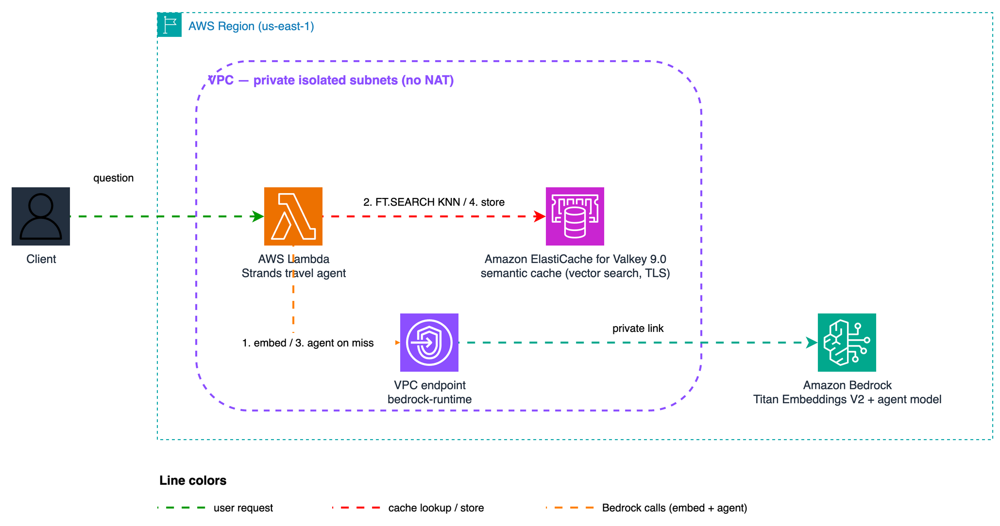

# Stop Paying for Repeated LLM Calls: Semantic Caching for AI Agents

AI agents answer the same questions over and over — and every repeat costs the full
LLM (Large Language Model) invocation. This sample adds two caching layers with
[Amazon ElastiCache for Valkey](https://aws.amazon.com/elasticache/?trk=87c4c426-cddf-4799-a299-273337552ad8&sc_channel=el):
a **semantic response cache** (repeated questions cost 0 tokens) and an **in-loop
reasoning cache** (new-but-similar questions skip exploration cycles and tool
executions). AWS's published benchmark for semantic caching reports up to
[86% cost savings and 88% latency reduction](https://docs.aws.amazon.com/AmazonElastiCache/latest/dg/semantic-caching-overview.html?trk=87c4c426-cddf-4799-a299-273337552ad8&sc_channel=el).

This sample works with Amazon ElastiCache for Valkey, Amazon Bedrock, and AWS Lambda.

> 💡 Built on [Strands Agents](https://strandsagents.com/?trk=87c4c426-cddf-4799-a299-273337552ad8&sc_channel=el).
> Semantic caching is a general agent pattern and carries over to other agent frameworks.

> ⚠️ This guide assumes familiarity with AWS CDK (Cloud Development Kit, Python)
> and Amazon Bedrock. Code in this repository is provided "as is", and is not
> officially supported by Amazon.

## Project structure — deploy in numeric order

Values flow between stacks exclusively through SSM Parameter Store
(`/semantic-cache/*`) — no hardcoded endpoints anywhere. Everything deploys
with CDK.

| Stack | Description | Stack |
|------|-------------|-------|
| [01-semantic-cache-valkey](./01-semantic-cache-valkey/) | Cache infrastructure: VPC, ElastiCache for Valkey 9.0 (vector search) + Serverless (tool cache), test agents, local dashboard |    |
| [02-production-agent](./02-production-agent/) | Strands agent on Amazon Bedrock AgentCore Runtime, VPC-attached for direct cache access |   |
| [03-production-website](./03-production-website/) | Secure real-time web chat: AppSync Events + Cognito + DynamoDB history + CloudFront frontend |   |

Inside stack 01, the two demos:

| Demo | Description |
|------|-------------|
| [travel_agent](./01-semantic-cache-valkey/lambdas/code/travel_agent/) | Query-level semantic cache: paraphrased repeat → cached answer (verbatim or rewrite mode) |
| [reasoning_agent](./01-semantic-cache-valkey/lambdas/code/reasoning_agent/) | In-loop reasoning cache via hooks: plan hints + tool-result cache, real APIs (Duffel, Wikipedia, Open-Meteo) |
| [local_app](./01-semantic-cache-valkey/local_app/) | Local dashboard: chat, live cache inventory, per-session token bars |

## What are the four levels of token savings?

| Level | Mechanism | What it saves |
|---|---|---|
| 1. Prompt caching | Bedrock cache points (built into most frameworks) | Input-token cost on repeated prefixes; the response is still generated |
| 2. Conversation management | Sliding window / summarization | History tokens re-sent every turn |
| 3. **Semantic response cache** | **Demo 01** | **The entire invocation on a cache hit** |
| 4. **In-loop reasoning cache** | **Demo 02** | **Exploration cycles + tool executions on NEW questions that resemble past ones** |

## How do the two demos differ?

Demo 01 treats the cached answer as the **output** (the LLM never runs on a hit);
Demo 02 treats cached data as **input** (the LLM always generates fresh, guided by
cached context). That single difference drives everything else:

| | Demo 01 — `travel_agent` | Demo 02 — `reasoning_agent` |
|---|---|---|
| Cache level | Before the agent (query-level) | Inside the agent loop (hooks) |
| Hits when | The same question is asked again (paraphrased or cross-language) | A new question resembles a past one |
| What is saved | Up to 100% of the invocation | Deliberation cycles + tool executions (40–85%) |
| Prompt sensitivity | Stale-prompt entries are rewritten, then self-healed | None — answers always generated under the current prompt |
| Strands mechanism | Wrapper around the invocation | [`BeforeInvocationEvent.messages`](https://strandsagents.com/docs/user-guide/concepts/agents/hooks/?trk=87c4c426-cddf-4799-a299-273337552ad8&sc_channel=el) (plan hint) + `BeforeToolCallEvent.selected_tool` (tool swap) |
| Measured | 0 tokens / 127 ms on verbatim hits | 4,035 tokens saved on a warm run (57%) |

### Demo 01 flow — query-level cache (serve verbatim or rewrite)


**Cache modes** (`CACHE_MODE` environment variable):

| Mode | On a paraphrased hit | Savings | Use when |
|---|---|---|---|
| `verbatim` | Stored answer returned as-is | 100% of the invocation | Same-language FAQ, maximum savings |
| `rewrite` (default) | The model adapts the **verified** cached answer to the question — language, tone, current prompt rules — without re-researching | Invocation minus a small rewrite call | Multilingual users, conversational phrasing |

Identical questions (similarity 1.0) under the current prompt are always served
verbatim — the rewrite only runs when it adds value. Entries generated under an
older system prompt are rewritten once and **self-healed** (the entry is updated),
so the next hit is verbatim again.

Cross-language works: asking in Spanish against an answer cached in English
measured similarity **0.93** (Titan Text Embeddings V2 is multilingual), and
rewrite mode returns the answer in the user's language.

### Demo 02 flow — in-loop reasoning cache (LLM always generates)


Two hooks, two savings:

1. **Plan hint** (reasoning savings): on a semantic match with a past question, the
   cached tool trajectory — with already-resolved arguments — is appended to the
   user message. The model issues the right tool calls in its **first** cycle
   instead of exploring.
2. **Tool cache** (execution savings): an exact repeated (tool, args) call is served
   by a stub returning the cached result; the real tool never executes.

## Architecture



Editable diagrams: [architecture](./images/architecture.drawio) ·
[demo 01 flow](./images/demo01-flow.drawio) · [demo 02 flow](./images/demo02-flow.drawio) ·
[cache flow](./images/cache-flow.drawio). Full design rationale, failure modes, and
cost notes are documented inline in each stack README.

### Split-store design (production pattern)

Each cache lives on the store that matches its access pattern:

| Workload | Store | Why |
|---|---|---|
| Question/trajectory embeddings (KNN) | **Node-based Valkey 9.0** | `FT.*` vector search requires node-based; memory is predictable (N × 4 KB) |
| Tool results (exact match) | **ElastiCache Serverless Valkey** | Ephemeral, TTL-heavy, unpredictable volume — serverless scales automatically, no node sizing |

## What real APIs do the agent tools call?

Demo 02's tools fetch live data — no hardcoded answers:

| Tool | API | Cache TTL (Time To Live) | Why that TTL |
|---|---|---|---|
| `geocode_destination` | [Open-Meteo Geocoding](https://open-meteo.com/) | 30 days | Coordinates are effectively immutable |
| `climate_summary` | [Open-Meteo Archive](https://open-meteo.com/) | 7 days | Historical climate updates monthly |
| `wikipedia_summary` | [Wikipedia REST](https://www.mediawiki.org/wiki/API:REST_API) | 24 hours | Policies change without notice |
| `search_flights` | [Duffel sandbox](https://duffel.com/) | **5 minutes** | Prices are volatile |

The flight tool is adapted from
[Ricardo Ceci's Strands course](https://github.com/ricardoceci/curso-strands-agentcore-2026);
its API key lives in AWS Secrets Manager (never an environment variable).

## How does the cache stay fresh when data changes (prices, policies)?

The reasoning cache stores *which tools to call* (stable) separately from *what the
tools returned* (volatile). Three mechanisms:

1. **Per-tool TTLs by volatility** (`TOOL_TTL_SECONDS` in `tools.py`) — see the
   table above. After a flight price expires, a repeat query re-fetches live prices
   while the cached reasoning remains valid.
2. **Version-keyed namespaces** (`CACHE_VERSIONS`): bump a tool's version to
   invalidate all its cached results at once (upstream schema/semantics change).
3. **Stale-on-error fallback**: every result also keeps a longer-lived stale copy;
   if the fresh entry expired AND the live call fails, the last known value is
   served marked `[stale]` — availability over perfect freshness, visible to the model.

For push-based invalidation (source system announces changes), subscribe a consumer
to the source's events and `DEL` the affected namespace — Valkey pub/sub or Amazon
EventBridge both work; not implemented in this sample.

## Quick start

Prerequisites: AWS account with Bedrock model access (Amazon Nova + Titan Text
Embeddings V2) in `us-east-1`, [uv](https://docs.astral.sh/uv/), Node.js with the
CDK CLI. Docker not required. Optional: a free [Duffel](https://duffel.com) sandbox
API key — export `DUFFEL_API_KEY` before `cdk deploy` (or set the created Secrets
Manager secret afterwards); the other three tools work without it.

```bash
# 1. Build the Lambda dependencies layer (ARM64 / Python 3.13)
cd 01-semantic-cache-valkey && bash scripts/build_layer.sh

# 2. Deploy (ElastiCache takes ~15 minutes)
uv venv --python 3.13 .venv && source .venv/bin/activate
uv pip install -r requirements.txt
cdk bootstrap   # first time in the account only
cdk deploy

# 3a. Demo 01: paraphrased pairs — first phrasing misses, paraphrase hits
python3 scripts/test_cache.py --function <FunctionName from stack output>

# 3b. Demo 02: cold run explores, warm paraphrase gets plan hint + tool cache
python3 scripts/test_reasoning_cache.py --function <ReasoningFunctionName from stack output>

# 4. Local dashboard — chat with both demos and watch the caches fill
uv pip install flask boto3
python3 local_app/server.py --stack SemanticCacheStack --region us-east-1
# open http://127.0.0.1:8080
```

### What does the dashboard show?

Per-answer badges (`cache hit · sim 0.96`, `agent ran`, `plan hint`, `N tool cache
hits`), per-session token bars (consumed vs saved), and a live inventory of both
stores where the per-tool TTLs are visible side by side. **Flush caches** resets
everything for a clean cold-run demo.

## What savings were measured?

All numbers from real deployments of this stack (Amazon Nova Lite,
`us-east-1`); your runs will vary because cold-run exploration is model-driven.

**Demo 01** (query-level):

| Scenario | Result |
|---|---|
| Identical question repeated | `source=cache`, 0 tokens, 112–146 ms |
| Paraphrase, same language | hit at similarity 0.92–0.96, 0 tokens (verbatim) |
| Same question in Spanish vs English cache | hit at similarity **0.93**, answer rewritten to Spanish (~195 rewrite tokens vs full re-research) |

**Demo 02** (in-loop, real-API tools):

| | Cold run | Warm run (plan hint) | Saved |
|---|---|---|---|
| Event-loop cycles | 5 | 2 | **60%** |
| Total tokens | 7,000 | 2,965 | **58% (4,035 tokens)** |
| Tool executions | 3 | 0 | **100%** |
| Flight search (Duffel) | 4 cycles / 5,754 tokens | 2 cycles / 2,790 tokens | **51%** |

Across test runs the warm savings ranged from 40% to 85% of tokens and cycles;
tool-execution savings are stable (~86–100%).

## Key implementation details

- **Vector search requires node-based Valkey 8.2+** — ElastiCache Serverless does
  not support `FT.*`. This stack deploys Valkey 9.0 on `cache.t4g.small`.
- **Burstable nodes need a memory reserve for search**: the stack sets
  `reserved-memory-percent = 30` via a parameter group; without it `FT.CREATE`
  is rejected at runtime (50% on micro instances).
- The agent model defaults to Amazon Nova Lite so the sample runs in any account
  with Bedrock enabled; swap `AGENT_MODEL_ID` for a Claude model if your account
  has access.
- Cache entries are **scoped by model id** and **tagged with the system-prompt
  hash**: an answer from one model is never served for another, and stale-prompt
  answers are rewritten (not discarded) before serving.
- The cache **fails open**: if Valkey or the embedding call is unavailable, the
  agent runs normally. Availability is probed with `FT._LIST`, never assumed.
- Dual-key layout keeps answer payloads out of the HNSW (Hierarchical Navigable
  Small World) index; TTLs include jitter to avoid synchronized expirations.
- Every hit returns its `similarity`, and near-misses log
  `cache_miss_best_similarity` so you can tune the threshold from real traffic.

## Cleanup

```bash
cdk destroy
```

Every resource uses `RemovalPolicy.DESTROY` — nothing is left behind.

## Troubleshooting

| Symptom | Resolution |
|---|---|
| `FT.*` commands rejected | Confirm engine 8.2+ **node-based** and the memory-reserve parameter group is attached |
| All lookups miss | Check `SIMILARITY_THRESHOLD` (0.85 default); CloudWatch logs include the computed `similarity` and `cache_miss_best_similarity` per request |
| Answers served in the wrong language | Set `CACHE_MODE=rewrite` (default) — `verbatim` returns answers exactly as first generated |
| A repeated question consumed tokens right after a deploy | Changing the system prompt marks entries stale; the first hit rewrites and self-heals, later hits are verbatim again |
| Flight tool returns an error | Set the Duffel key: `aws secretsmanager put-secret-value --secret-id <DuffelApiKey ARN> --secret-string <key>` |
| First invocation slow | Cold start + lazy index creation; subsequent calls are fast |

## FAQ

**Is the cache per user or per session?**
Global — an answer cached for one user serves every user. That is correct for
factual FAQ content; partition with a tenant TAG in the index if answers become
user-specific. The dashboard's "sessions" only group local token statistics.

**Why not run everything on ElastiCache Serverless?**
Vector search (`FT.*`) is only available on node-based Valkey 8.2+. Serverless
hosts the exact-match tool cache, where it fits the access pattern best.

**Does this replace Bedrock prompt caching?**
No — they stack. Prompt caching cuts input-token cost but still generates every
response; the semantic cache skips generation entirely on a hit.

**What happens if two questions are similar but need different answers?**
The threshold (0.85 cosine similarity) controls that risk; every hit reports its
similarity so false hits are auditable, and stricter thresholds trade hit ratio
for precision.

**Can I use a different embedding model?**
Yes — change `EMBEDDING_MODEL_ID`, but the `FT.CREATE` schema `DIM` must match the
model's output dimensions exactly (Titan Text Embeddings V2 = 1024), and changing
models requires re-indexing existing vectors.

## References

- [Semantic caching with ElastiCache — AWS documentation](https://docs.aws.amazon.com/AmazonElastiCache/latest/dg/semantic-caching-overview.html?trk=87c4c426-cddf-4799-a299-273337552ad8&sc_channel=el)
- [Vector search for Amazon ElastiCache announcement](https://aws.amazon.com/blogs/database/announcing-vector-search-for-amazon-elasticache/?trk=87c4c426-cddf-4799-a299-273337552ad8&sc_channel=el)
- [Strands Agents hooks documentation](https://strandsagents.com/docs/user-guide/concepts/agents/hooks/?trk=87c4c426-cddf-4799-a299-273337552ad8&sc_channel=el)
- [Well-Architected Agentic AI Lens: agent caching layers](https://docs.aws.amazon.com/wellarchitected/latest/agentic-ai-lens/agentperf03-bp04.html?trk=87c4c426-cddf-4799-a299-273337552ad8&sc_channel=el)
- [Valkey project](https://valkey.io/)

---

## Contributing

Contributions are welcome! See [CONTRIBUTING](CONTRIBUTING.md) for more information.

---

## Security

If you discover a potential security issue in this project, notify AWS/Amazon Security via the [vulnerability reporting page](http://aws.amazon.com/security/vulnerability-reporting/?trk=87c4c426-cddf-4799-a299-273337552ad8&sc_channel=el). Please do **not** create a public GitHub issue.

---

## License

This library is licensed under the MIT-0 License. See the [LICENSE](LICENSE) file for details.
