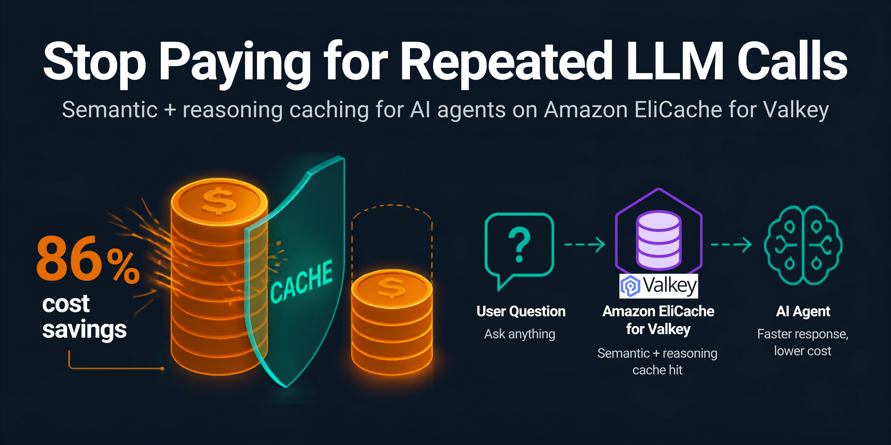
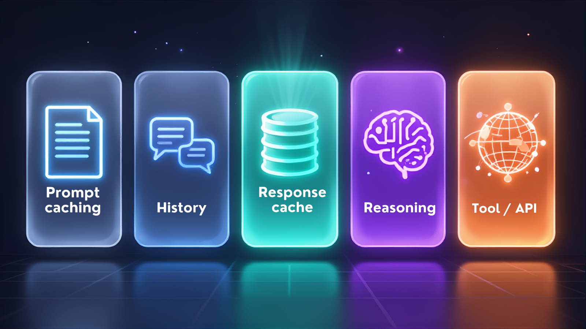
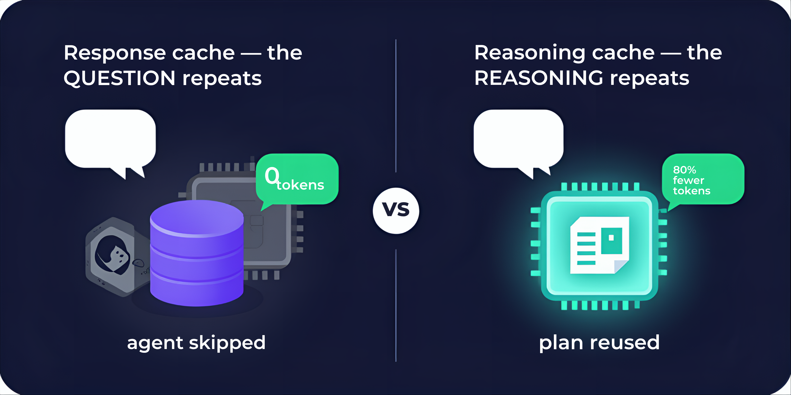
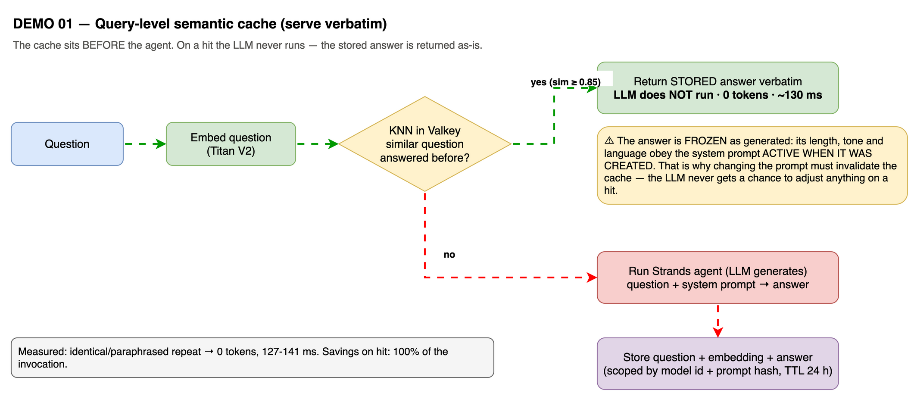
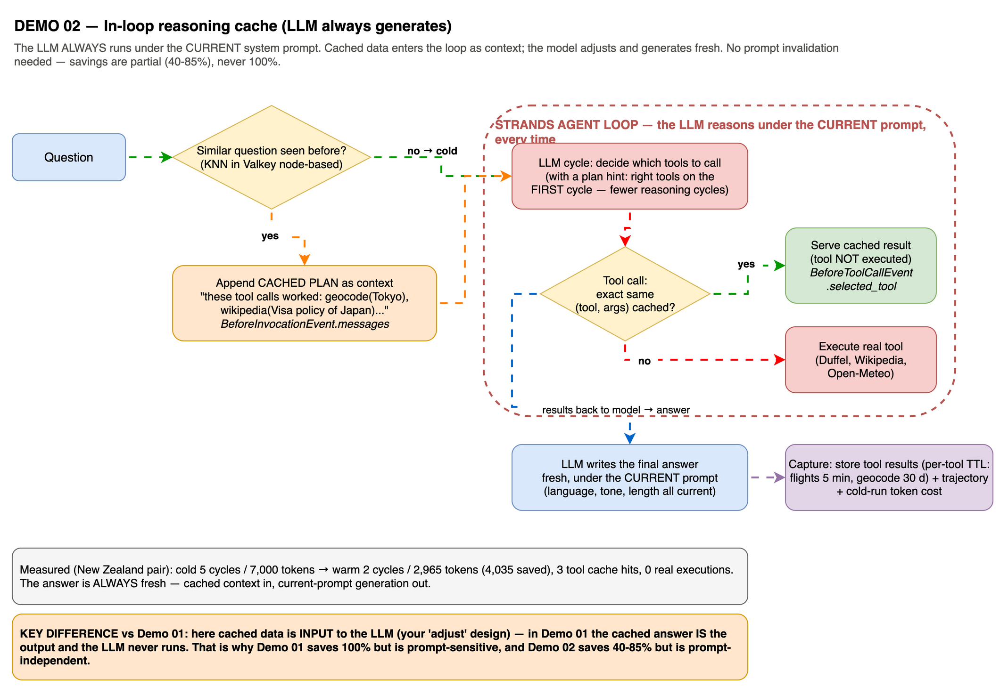

# Prompt Caching Isn't Enough: Semantic and Reasoning Caches for AI Agents

AI agents answer the same questions over and over, and every repeat costs the full
LLM (Large Language Model) invocation. This sample adds two caching layers with
[Amazon ElastiCache for Valkey](https://aws.amazon.com/elasticache/?trk=87c4c426-cddf-4799-a299-273337552ad8&sc_channel=el):
a **semantic response cache** (repeated questions cost 0 tokens) and an **in-loop
reasoning cache** (new-but-similar questions skip exploration cycles and tool
executions). AWS's published benchmark for semantic caching reports up to
[86% cost savings and 88% latency reduction](https://docs.aws.amazon.com/AmazonElastiCache/latest/dg/semantic-caching-overview.html?trk=87c4c426-cddf-4799-a299-273337552ad8&sc_channel=el).

This sample ships **two interchangeable cache backends** - in-memory
[Amazon ElastiCache for Valkey](https://aws.amazon.com/elasticache/?trk=87c4c426-cddf-4799-a299-273337552ad8&sc_channel=el)
and serverless [Amazon DynamoDB vector search](https://docs.aws.amazon.com/amazondynamodb/latest/developerguide/VectorSearch.html?trk=87c4c426-cddf-4799-a299-273337552ad8&sc_channel=el)
- both alongside Amazon Bedrock and AWS Lambda. The agent logic, tools, and web
UI are identical across the two; only the cache infrastructure changes.

> 💡 Built on [Strands Agents](https://strandsagents.com/?trk=87c4c426-cddf-4799-a299-273337552ad8&sc_channel=el).

> ⚠️ **This is a demo, not production code.** Everything here is meant to teach
> the caching pattern. It is provided "as is", is not officially supported by
> Amazon, and is not safe for personal data as shipped (see [Is this cache safe
> for personal data?](#is-this-cache-safe-for-personal-data-read-before-production)).
> Validate, add PII detection, and partition per tenant before using any of this
> in production.

## Project structure: deploy in numeric order

This repo has **two parallel tracks** - the same agent, tools, and web UI on two
different cache backends. Pick the one that matches your workload; both deploy with
CDK, and values flow between stacks exclusively through SSM Parameter Store
(`/semantic-cache/*`), with no hardcoded endpoints anywhere.

| Track | Cache backend | Best for | README |
|-------|---------------|----------|--------|
| [cache-valkey/](./cache-valkey/) | In-memory ElastiCache for Valkey (node-based vector search + Serverless tool cache) | Sustained hot-path traffic, lowest latency, already in a VPC | [cache-valkey/README.md](./cache-valkey/README.md) |
| [cache-dynamodb/](./cache-dynamodb/) | Serverless DynamoDB vector search (one table) | Spiky traffic, zero idle cost, no VPC | [cache-dynamodb/README.md](./cache-dynamodb/README.md) |

> 🧑‍🏫 **New to this? Start with a local tutorial, no CDK.** Each track has a
> `local/` folder that caches a Strands agent with three hooks from a Jupyter
> notebook, plus a Streamlit chat: [cache-dynamodb/local](./cache-dynamodb/local/)
> (nothing to run locally, just AWS credentials) or
> [cache-valkey/local](./cache-valkey/local/) (a local Valkey container). They
> teach the same caching pattern the production stacks use, in plain readable
> Python.

The stacks below are the **Valkey track**; the DynamoDB track mirrors them 1:1
(see its README). Deploy in numeric order.

| Stack | Description | Stack |
|------|-------------|-------|
| [cache-valkey/01-cache-layers-valkey](./cache-valkey/01-cache-layers-valkey/) | Cache infrastructure: VPC, ElastiCache for Valkey 9.0 (vector search) + Serverless (tool cache), test agents, local dashboard |    |
| [cache-valkey/02-production-agent](./cache-valkey/02-production-agent/) | Two Strands agents (production + a plan-template cache agent) on Amazon Bedrock AgentCore Runtime, VPC-attached for direct cache access |   |
| [cache-valkey/03-production-website](./cache-valkey/03-production-website/) | Secure real-time web chat: AppSync Events + Cognito + DynamoDB history + CloudFront frontend |   |

> 🔁 **Serverless variant:** the [cache-dynamodb/](./cache-dynamodb/) track implements the
> same application-level caches on [Amazon DynamoDB vector search](https://docs.aws.amazon.com/amazondynamodb/latest/developerguide/VectorSearch.html?trk=87c4c426-cddf-4799-a299-273337552ad8&sc_channel=el)
> - one table, no VPC, no clusters. See its [README](./cache-dynamodb/README.md) for the trade-offs.

Inside stack 01, the two demos:

| Demo | Description |
|------|-------------|
| [travel_agent](./cache-valkey/01-cache-layers-valkey/lambdas/code/travel_agent/) | Query-level semantic cache: paraphrased repeat → cached answer (verbatim or rewrite mode) |
| [reasoning_agent](./cache-valkey/01-cache-layers-valkey/lambdas/code/reasoning_agent/) | In-loop reasoning cache via hooks: plan hints + tool-result cache, real APIs (Duffel, Wikipedia, Open-Meteo) |
| [local_app](./cache-valkey/01-cache-layers-valkey/local_app/) | Local dashboard: chat, live cache inventory, per-session token bars |

## What does each cache layer save?



Not every cache in this sample saves tokens - being precise about WHAT each
layer saves is the point of the demo:

| Layer | Mechanism | What it saves |
|---|---|---|
| 1. Native prompt caching | Provider-side prefix cache (below) | **Input-token price** on repeated prompt prefixes; the model still generates every response |
| 2. Conversation management | Sliding window / summarization | History tokens re-sent every turn |
| 3. **Semantic response cache** | **Demo 01** | **LLM tokens: the entire generation is skipped on a hit** |
| 4. **Reasoning cache** | **Demo 02 + the plan-template cache** | **Deliberation tokens: fewer/cheaper planning cycles on similar questions** |
| 5. **Tool-result cache** | Part of Demo 02 | **The external API invocation itself**: latency, third-party cost, and rate limits (Duffel, Wikipedia, Open-Meteo). Token impact is indirect - results return instantly, which shortens cycles |

The two application-level caches this sample implements save different things:
a **response cache** fires when the *question* repeats, a **reasoning cache**
fires when the *reasoning* repeats.



### How is this different from the LLM providers' native caching?

Every major provider ships *prompt caching* (Gemini calls it *context
caching*). It is a different layer that **stacks** with this sample's caches.
What providers actually cache, per their own documentation, is the
**processed prefix of your prompt** - internally the transformer's key/value
states: OpenAI's docs describe extended cache retention as "offload[ing]
key/value tensors to GPU-local storage" ([source](https://developers.openai.com/api/docs/guides/prompt-caching)),
and the underlying technique is described in the SGLang paper as
"RadixAttention for KV cache reuse" ([arXiv:2312.07104](https://arxiv.org/abs/2312.07104)).

The critical difference, in the providers' own words: prompt caching never
returns a stored response. Anthropic: "Prompt caching has no effect on output
token generation. The response you receive is identical to what you would get
if prompt caching were not used"
([docs](https://platform.claude.com/docs/en/build-with-claude/prompt-caching)).
OpenAI: "Prompt Caching does not change how the model generates output tokens"
([docs](https://developers.openai.com/api/docs/guides/prompt-caching)). The
model reasons and generates every time; only re-processing your input prefix
is skipped. This sample's caches skip the generation, the deliberation, or the
external API call entirely.

Facts below were taken from each provider's documentation pages (fetched
2026-08-06); where a page does not state a number, the cell says so:

| | [Amazon Bedrock](https://docs.aws.amazon.com/bedrock/latest/userguide/prompt-caching.html?trk=87c4c426-cddf-4799-a299-273337552ad8&sc_channel=el) | [Anthropic](https://platform.claude.com/docs/en/build-with-claude/prompt-caching) | [OpenAI](https://developers.openai.com/api/docs/guides/prompt-caching) | [Gemini](https://ai.google.dev/gemini-api/docs/caching) |
|---|---|---|---|---|
| Activation | Explicit `cachePoint` markers (Nova: automatic) | Explicit `cache_control` breakpoints or automatic mode | Automatic at ≥1,024 tokens; explicit breakpoints on newer models | Implicit (automatic, 2.5+) or explicit cache objects |
| Hit requires | "Static" exact prefix; `tools`→`system`→`messages` order; edits invalidate everything after | "100% identical prompt segments, including all text and images"; ~20-block lookback | "Exact prefix matches"; hash of ~first 256 tokens routes the request | Common prefix (implicit) or referenced cache object (explicit) |
| Default lifetime | ~5 min for many models, resets on hit; 1 h option on some Claude models | 5 min, refreshed free on each use; 1 h at extra cost | 5–10 min of inactivity, up to 1 h; extended up to 24 h on some models | Explicit: 1 h default, configurable with no bounds |
| Cache write cost | "May be charged at a rate that is higher" (see pricing page) | 1.25x base input (5 min) / 2x (1 h) | Free on models before GPT-5.6; 1.25x after | No write premium stated; explicit caches bill storage per token-hour |
| Cache read cost | "Reduced rate" (per-model pricing page) | 0.1x base input (90% discount) | "Cached-input rate" - the docs page states no percentage | ~10% of the input rate per the [pricing page](https://ai.google.dev/gemini-api/docs/pricing) |
| Isolation | Not stated on the page | "Caches are isolated between organizations" | "Prompt caches are not shared between organizations" | Not stated on the caching pages |
| Sharing across your users | No - prefix caching is per-conversation-shape | Same | Same | Same |
| **This sample's caches** | **Answers, plans, and tool results in YOUR ElastiCache: semantic matching, your TTLs (5 min-30 days), shared across all users and sessions, and a hit skips generation/deliberation/API calls entirely** | | | |

Use both layers: prompt caching cuts the price of the input tokens you DO
send; these caches remove the generations and API calls you DON'T need to
make at all.

## How do the two demos differ?

Demo 01 treats the cached answer as the **output** (the LLM never runs on a hit);
Demo 02 treats cached data as **input** (the LLM always generates fresh, guided by
cached context). That single difference drives everything else:

| | Demo 01: `travel_agent` | Demo 02: `reasoning_agent` |
|---|---|---|
| Cache level | Before the agent (query-level) | Inside the agent loop (hooks) |
| Hits when | The same question is asked again (paraphrased or cross-language) | A new question resembles a past one |
| What is saved | Up to 100% of the invocation | Deliberation cycles + tool executions (40–85%) |
| Prompt sensitivity | Stale-prompt entries are rewritten, then self-healed | None. Answers are always generated under the current prompt |
| Strands mechanism | Wrapper around the invocation | [`BeforeInvocationEvent.messages`](https://strandsagents.com/docs/user-guide/concepts/agents/hooks/?trk=87c4c426-cddf-4799-a299-273337552ad8&sc_channel=el) (plan hint) + `BeforeToolCallEvent.selected_tool` (tool swap) |
| Measured | 0 tokens / 127 ms on verbatim hits | 4,035 tokens saved on a warm run (58%) |

### Demo 01 flow: query-level cache (serve verbatim or rewrite)



**Cache modes** (`CACHE_MODE` environment variable):

| Mode | On a paraphrased hit | Savings | Use when |
|---|---|---|---|
| `verbatim` | Stored answer returned as-is | 100% of the invocation | Same-language FAQ, maximum savings |
| `rewrite` (default) | The model adapts the **verified** cached answer to the question (language, tone, current prompt rules) without re-researching | Invocation minus a small rewrite call | Multilingual users, conversational phrasing |

Identical questions (similarity 1.0) under the current prompt are always served
verbatim; the rewrite only runs when it adds value. Entries generated under an
older system prompt are rewritten once and **self-healed** (the entry is updated),
so the next hit is verbatim again.

Cross-language works: asking in Spanish against an answer cached in English
measured similarity **0.93** (Titan Text Embeddings V2 is multilingual), and
rewrite mode returns the answer in the user's language.

### Demo 02 flow: in-loop reasoning cache (LLM always generates)



Two hooks, two savings:

1. **Plan hint** (reasoning savings): on a semantic match with a past question, the
   cached tool trajectory, with already-resolved arguments, is appended to the
   user message. The model issues the right tool calls in its **first** cycle
   instead of exploring.
2. **Tool cache** (execution savings): an exact repeated (tool, args) call is served
   by a stub returning the cached result; the real tool never executes.

## Architecture


Editable diagrams: [architecture](./images/architecture.drawio) ·
[demo 01 flow](./images/demo01-flow.drawio) · [demo 02 flow](./images/demo02-flow.drawio) ·
[cache flow](./images/cache-flow.drawio). Full design rationale, failure modes, and
cost notes are documented inline in each stack README.

### Split-store design (production pattern)

Each cache lives on the store that matches its access pattern:

| Workload | Store | Why |
|---|---|---|
| Question/trajectory embeddings (KNN) | **Node-based Valkey 9.0** | `FT.*` vector search requires node-based; memory is predictable (N × 4 KB) |
| Tool results (exact match) | **ElastiCache Serverless Valkey** | Ephemeral, TTL-heavy, unpredictable volume; serverless scales automatically, no node sizing |

## What real APIs do the agent tools call?

Demo 02's tools fetch live data (no hardcoded answers):

| Tool | API | Cache TTL (Time To Live) | Why that TTL |
|---|---|---|---|
| `geocode_destination` | [Open-Meteo Geocoding](https://open-meteo.com/) | 30 days | Coordinates are effectively immutable |
| `climate_summary` | [Open-Meteo Archive](https://open-meteo.com/) | 7 days | Historical climate updates monthly |
| `wikipedia_summary` | [Wikipedia REST](https://www.mediawiki.org/wiki/API:REST_API) | 24 hours | Policies change without notice |
| `search_flights` | [Duffel sandbox](https://duffel.com/) | **5 minutes** | Prices are volatile |

The flight tool is adapted from
[Ricardo Ceci's Strands course](https://github.com/ricardoceci/curso-strands-agentcore-2026);
its API key lives in AWS Secrets Manager (never an environment variable).

## How does the cache stay fresh when data changes (prices, policies)?

The reasoning cache stores *which tools to call* (stable) separately from *what the
tools returned* (volatile). Three mechanisms:

1. **Per-tool TTLs by volatility** (`TOOL_TTL_SECONDS` in `tools.py`); see the
   table above. After a flight price expires, a repeat query re-fetches live prices
   while the cached reasoning remains valid.
2. **Version-keyed namespaces** (`CACHE_VERSIONS`): bump a tool's version to
   invalidate all its cached results at once (upstream schema/semantics change).
3. **Stale-on-error fallback**: every result also keeps a longer-lived stale copy;
   if the fresh entry expired AND the live call fails, the last known value is
   served marked `[stale]`: availability over perfect freshness, visible to the model.

For push-based invalidation (source system announces changes), subscribe a consumer
to the source's events and `DEL` the affected namespace. Valkey pub/sub or Amazon
EventBridge both work; not implemented in this sample.

## Quick start

### What are the prerequisites?

**Start here: an AWS account and credentials.** If you do not have an account,
[create a free one](https://aws.amazon.com/free/) and then set up credentials on
your machine with `aws configure` ([how to get access
keys](https://docs.aws.amazon.com/cli/latest/userguide/cli-configure-files.html?trk=87c4c426-cddf-4799-a299-273337552ad8&sc_channel=el)).
That plus Bedrock model access (a one-time toggle in the console, no engineering
needed) is everything the local notebook tutorials require.

| Requirement | Needed for | Details |
|-------------|-----------|---------|
| AWS account + credentials | Everything | [Create an account](https://aws.amazon.com/free/), then `aws configure` ([get access keys](https://docs.aws.amazon.com/cli/latest/userguide/cli-configure-files.html?trk=87c4c426-cddf-4799-a299-273337552ad8&sc_channel=el)) |
| Bedrock model access | Everything | Enable Amazon Nova Lite + Titan Text Embeddings V2 in `us-east-1` from the [model access console](https://docs.aws.amazon.com/bedrock/latest/userguide/model-access.html?trk=87c4c426-cddf-4799-a299-273337552ad8&sc_channel=el). It is a checkbox, not code |
| Python 3.11+ | The local notebooks | `pip install -r requirements.txt` in either `local/` folder |
| `boto3 >= 1.43.72` | DynamoDB track only | DynamoDB vector search (`search_vectors`) needs this minimum; it is pinned in the DynamoDB `requirements.txt`. The Valkey track has no such minimum |
| Docker or colima | Valkey local only | Runs the local Valkey container (`valkey/valkey-bundle`). Not needed for the DynamoDB track |
| Python 3.13 + [uv](https://docs.astral.sh/uv/) | Production CDK stacks | The stacks build their virtualenvs with uv |
| Node.js 22+ with the CDK CLI | Production CDK stacks | `npm install -g aws-cdk`; the account must be [CDK-bootstrapped](https://docs.aws.amazon.com/cdk/v2/guide/bootstrapping.html?trk=87c4c426-cddf-4799-a299-273337552ad8&sc_channel=el) |
| `DUFFEL_API_KEY` env var | The flight tool | Free sandbox key from [duffel.com](https://duffel.com); the other three tools work without it (warning below) |

> 🧑‍🏫 **Want the shortest path?** The `local/` tutorials need only the first
> three rows: an AWS account, Bedrock access, and Python. No CDK, no VPC, no
> Docker (for the DynamoDB track). Start there.

### Which model provider? (you are not tied to Bedrock)

The agent runs on [Strands Agents](https://strandsagents.com/?trk=87c4c426-cddf-4799-a299-273337552ad8&sc_channel=el),
which is model-provider agnostic. This sample defaults to Amazon Bedrock (Nova
Lite), but the caches do not care which model generates the answer: swapping the
provider is two lines and touches nothing else (not the tools, not the hooks, not
the cache). For example, to use OpenAI instead of Bedrock:

```python
from strands.models.openai import OpenAIModel

model = OpenAIModel(client_args={"api_key": "<key>"}, model_id="gpt-4o")
agent = Agent(model=model, system_prompt=SYSTEM_PROMPT, tools=ALL_TOOLS)
```

Strands ships providers for
[Amazon Bedrock](https://strandsagents.com/docs/user-guide/concepts/model-providers/amazon-bedrock/?trk=87c4c426-cddf-4799-a299-273337552ad8&sc_channel=el),
[Anthropic](https://strandsagents.com/docs/user-guide/concepts/model-providers/anthropic/?trk=87c4c426-cddf-4799-a299-273337552ad8&sc_channel=el),
[OpenAI](https://strandsagents.com/docs/user-guide/concepts/model-providers/openai/?trk=87c4c426-cddf-4799-a299-273337552ad8&sc_channel=el),
[Ollama](https://strandsagents.com/docs/user-guide/concepts/model-providers/ollama/?trk=87c4c426-cddf-4799-a299-273337552ad8&sc_channel=el),
and more. One thing stays on Bedrock in this sample: the **embeddings** (Titan
Text Embeddings V2), because the embedding is what decides a cache hit. The
generation model and the embedding model are independent choices.

> ⚠️ **The flight tool needs `DUFFEL_API_KEY` exported BEFORE `cdk deploy`**
> (free sandbox key from [Duffel](https://duffel.com)). Without it,
> `search_flights` returns errors until you put the real value in the created
> Secrets Manager secret. The other three tools work without it.

```bash
# ---- Stack 01: cache infrastructure + test agents (from the repo root) ----
cd cache-valkey/01-cache-layers-valkey
bash scripts/build_layer.sh                     # Lambda deps layer (ARM64 / Python 3.13)
uv venv --python 3.13 .venv && source .venv/bin/activate
uv pip install -r requirements.txt boto3
cdk bootstrap                                   # first time in the account only
cdk deploy                                      # ElastiCache takes ~15 minutes

# Test both demos against the deployed Lambdas
python3 scripts/test_cache.py --function <FunctionName output>
python3 scripts/test_reasoning_cache.py --function <ReasoningFunctionName output>

# Optional: local dashboard at http://127.0.0.1:8080
uv pip install flask
python3 local_app/server.py --stack SemanticCacheStack --region us-east-1
deactivate

# ---- Stack 02: production agent on AgentCore Runtime ----
cd ../02-production-agent
bash create_deployment_package.sh               # ARM64 ZIP (no Docker)
uv venv --python 3.13 .venv && source .venv/bin/activate
uv pip install -r requirements.txt boto3
cdk deploy
deactivate

# ---- Stack 03: production website (backend, then frontend) ----
cd ../03-production-website/backend
uv venv --python 3.13 .venv && source .venv/bin/activate
uv pip install -r requirements.txt boto3
cdk deploy
deactivate

cd ../frontend/dashboard
bash generate_config.sh                         # builds config.js from SSM
cd ..
uv venv --python 3.13 .venv && source .venv/bin/activate
uv pip install -r requirements.txt
cdk deploy SemanticCacheWebsiteStack            # outputs the CloudFront URL
```

Create a login for the website (self sign-up is disabled by design):

```bash
aws cognito-idp admin-create-user --user-pool-id <pool id> --username <email> \
  --user-attributes Name=email,Value=<email> Name=email_verified,Value=true \
  --message-action SUPPRESS
aws cognito-idp admin-set-user-password --user-pool-id <pool id> \
  --username <email> --password '<password>' --permanent
```

### What does the dashboard show?

Per-answer badges (`cache hit · sim 0.96`, `agent ran`, `plan hint`, `N tool cache
hits`), per-session token bars (consumed vs saved), and a live inventory of both
stores where the per-tool TTLs are visible side by side. **Flush caches** resets
everything for a clean cold-run demo.

## What savings were measured?

All numbers from real deployments of this stack (Amazon Nova Lite,
`us-east-1`); your runs will vary because cold-run exploration is model-driven.

**Demo 01** (query-level):

| Scenario | Result |
|---|---|
| Identical question repeated | `source=cache`, 0 tokens, 112–146 ms |
| Paraphrase, same language | hit at similarity 0.92–0.96, 0 tokens (verbatim) |
| Same question in Spanish vs English cache | hit at similarity **0.93**, answer rewritten to Spanish (~195 rewrite tokens vs full re-research) |

**Demo 02** (in-loop, real-API tools):

| | Cold run | Warm run (plan hint) | Saved |
|---|---|---|---|
| Event-loop cycles | 5 | 2 | **60%** |
| Total tokens | 7,000 | 2,965 | **58% (4,035 tokens)** |
| Tool executions | 3 | 0 | **100%** |
| Flight search (Duffel) | 4 cycles / 5,754 tokens | 2 cycles / 2,790 tokens | **51%** |

Across test runs the warm savings ranged from 40% to 85% of tokens and cycles;
tool-execution savings are stable (~86–100%).

## Is this cache safe for personal data? (Read before production)

**No - this is a demo.** Nothing in this sample inspects what gets written to
the cache. In production, a shared semantic cache is a data-exfiltration and
poisoning surface: a cached answer containing one user's personal data can be
served to another user whose question is merely *similar*, and content read
from untrusted sources (web pages, documents) can plant instructions that get
cached and replayed. Before taking this pattern to production:

- **Validate before the agent writes to memory or cache.** Techniques and
  Strands examples: [Stop AI Agent Hallucinations: Validate Before the Agent
  Writes to Memory](https://dev.to/aws/stop-ai-agent-hallucinations-validate-before-the-agent-writes-to-memory-57om)
  and [How to Stop RAG Hallucinations Poisoning Your Vector
  Store](https://dev.to/aws/how-to-stop-rag-hallucinations-poisoning-your-vector-store-2l59).
- **Guard against prompt injection in tool outputs** before they reach the
  cache: [How to Stop Prompt Injection in AI Agents That Read Untrusted
  Content](https://dev.to/aws/how-to-stop-prompt-injection-in-ai-agents-that-read-untrusted-content-2j53).
- **Detect PII (Personally Identifiable Information) at the cache boundary**
  with a `BeforeToolCallEvent`/write-path hook: run entries through [Amazon
  Comprehend PII detection](https://docs.aws.amazon.com/comprehend/latest/dg/how-pii.html?trk=87c4c426-cddf-4799-a299-273337552ad8&sc_channel=el)
  or [Amazon Bedrock Guardrails sensitive-information
  filters](https://docs.aws.amazon.com/bedrock/latest/userguide/guardrails-sensitive-filters.html?trk=87c4c426-cddf-4799-a299-273337552ad8&sc_channel=el)
  and skip caching (or redact) anything flagged. The same Strands hooks this
  sample uses for caching are the natural interception point.
- **Partition the cache per tenant/user** (TAG field in the index) the moment
  answers can depend on who is asking.

## Key implementation details

- **Vector search requires node-based Valkey 8.2+**. ElastiCache Serverless does
  not support `FT.*`. This stack deploys Valkey 9.0 on `cache.t4g.small`.
- **Burstable nodes need a memory reserve for search**: the stack sets
  `reserved-memory-percent = 30` via a parameter group; without it `FT.CREATE`
  is rejected at runtime (50% on micro instances).
- The agent model defaults to Amazon Nova Lite so the sample runs in any account
  with Bedrock enabled; swap `AGENT_MODEL_ID` for a Claude model if your account
  has access.
- Cache entries are **scoped by model id** and **tagged with the system-prompt
  hash**: an answer from one model is never served for another, and stale-prompt
  answers are rewritten (not discarded) before serving.
- The cache **fails open**: if Valkey or the embedding call is unavailable, the
  agent runs normally. Availability is probed with `FT._LIST`, never assumed.
- Dual-key layout keeps answer payloads out of the HNSW (Hierarchical Navigable
  Small World) index; TTLs include jitter to avoid synchronized expirations.
- Every hit returns its `similarity`, and near-misses log
  `cache_miss_best_similarity` so you can tune the threshold from real traffic.

## What does this demo cost to run?

Approximate cost with all three stacks deployed in `us-east-1`, at demo-level
traffic (a few hundred questions). Always check the official pricing pages;
these numbers drift.

| Service | What this demo uses | Approx. cost | Pricing page |
|---------|--------------------|--------------|--------------|
| ElastiCache for Valkey (node-based) | 1× `cache.t4g.small` | ~$0.032/hour (~$23/month) | [ElastiCache pricing](https://aws.amazon.com/elasticache/pricing/?trk=87c4c426-cddf-4799-a299-273337552ad8&sc_channel=el) |
| ElastiCache Serverless (Valkey) | Tool cache, ~100 MB floor | ~$6/month minimum + per-request ECPUs | [ElastiCache pricing](https://aws.amazon.com/elasticache/pricing/?trk=87c4c426-cddf-4799-a299-273337552ad8&sc_channel=el) |
| NAT Gateway | 1× (agent tools call public APIs) | ~$0.045/hour + $0.045/GB (~$33/month) | [VPC pricing](https://aws.amazon.com/vpc/pricing/?trk=87c4c426-cddf-4799-a299-273337552ad8&sc_channel=el) |
| VPC interface endpoint | 1× bedrock-runtime, 2 AZs | ~$0.02/hour (~$15/month) | [PrivateLink pricing](https://aws.amazon.com/privatelink/pricing/?trk=87c4c426-cddf-4799-a299-273337552ad8&sc_channel=el) |
| Bedrock AgentCore Runtime | Per-second CPU/memory while a session is active; idle sessions time out at 15 min | Cents at demo volume | [AgentCore pricing](https://aws.amazon.com/bedrock/agentcore/pricing/?trk=87c4c426-cddf-4799-a299-273337552ad8&sc_channel=el) |
| Amazon Bedrock (Nova Lite + Titan Embeddings V2) | Agent generations and embeddings | Nova Lite $0.06/$0.24 per 1M input/output tokens; Titan V2 $0.02/1M. Cents at demo volume | [Bedrock pricing](https://aws.amazon.com/bedrock/pricing/?trk=87c4c426-cddf-4799-a299-273337552ad8&sc_channel=el) |
| AWS Lambda | 2 test agents + 4 website Lambdas, ARM64 | Free tier covers demo volume | [Lambda pricing](https://aws.amazon.com/lambda/pricing/?trk=87c4c426-cddf-4799-a299-273337552ad8&sc_channel=el) |
| AWS AppSync Events | WebSocket connections + events | $1.00/million events; cents at demo volume | [AppSync pricing](https://aws.amazon.com/appsync/pricing/?trk=87c4c426-cddf-4799-a299-273337552ad8&sc_channel=el) |
| Amazon Cognito | User pool, a handful of users | Free tier (50k MAUs) | [Cognito pricing](https://aws.amazon.com/cognito/pricing/?trk=87c4c426-cddf-4799-a299-273337552ad8&sc_channel=el) |
| Amazon DynamoDB | Chat history, on-demand | Cents at demo volume | [DynamoDB pricing](https://aws.amazon.com/dynamodb/pricing/?trk=87c4c426-cddf-4799-a299-273337552ad8&sc_channel=el) |
| Amazon CloudFront + S3 | Dashboard hosting | Free tier covers demo volume | [CloudFront pricing](https://aws.amazon.com/cloudfront/pricing/?trk=87c4c426-cddf-4799-a299-273337552ad8&sc_channel=el) |

**Ballpark total: about $2.60/day (~$78/month) if left running**, dominated by
the three always-on pieces: NAT Gateway, the Valkey node, and the VPC endpoint.
Everything else is effectively free at demo traffic. Destroy the stacks when
you finish testing (below) and the cost stops.

## Cleanup

```bash
cdk destroy
```

Every resource uses `RemovalPolicy.DESTROY`, so nothing is left behind.

## Troubleshooting

| Symptom | Resolution |
|---|---|
| `FT.*` commands rejected | Confirm engine 8.2+ **node-based** and the memory-reserve parameter group is attached |
| All lookups miss | Check `SIMILARITY_THRESHOLD` (0.85 default); CloudWatch logs include the computed `similarity` and `cache_miss_best_similarity` per request |
| Answers served in the wrong language | Set `CACHE_MODE=rewrite` (default); `verbatim` returns answers exactly as first generated |
| A repeated question consumed tokens right after a deploy | Changing the system prompt marks entries stale; the first hit rewrites and self-heals, later hits are verbatim again |
| Flight tool returns an error | Set the Duffel key: `aws secretsmanager put-secret-value --secret-id <DuffelApiKey ARN> --secret-string <key>` |
| First invocation slow | Cold start + lazy index creation; subsequent calls are fast |

## FAQ

**Is the cache per user or per session?**
Global: an answer cached for one user serves every user. That is correct for
factual FAQ content; partition with a tenant TAG in the index if answers become
user-specific. The dashboard's "sessions" only group local token statistics.

**Why not run everything on ElastiCache Serverless?**
Vector search (`FT.*`) is only available on node-based Valkey 8.2+. Serverless
hosts the exact-match tool cache, where it fits the access pattern best.

**Does this replace Bedrock prompt caching?**
No, they stack. Prompt caching cuts input-token cost but still generates every
response; the semantic cache skips generation entirely on a hit.

**What happens if two questions are similar but need different answers?**
The threshold (0.85 cosine similarity) controls that risk; every hit reports its
similarity so false hits are auditable, and stricter thresholds trade hit ratio
for precision.

**Can I use a different embedding model?**
Yes: change `EMBEDDING_MODEL_ID`, but the `FT.CREATE` schema `DIM` must match the
model's output dimensions exactly (Titan Text Embeddings V2 = 1024), and changing
models requires re-indexing existing vectors.

## References

- [Semantic caching with ElastiCache (AWS documentation)](https://docs.aws.amazon.com/AmazonElastiCache/latest/dg/semantic-caching-overview.html?trk=87c4c426-cddf-4799-a299-273337552ad8&sc_channel=el)
- [Vector search for Amazon ElastiCache announcement](https://aws.amazon.com/blogs/database/announcing-vector-search-for-amazon-elasticache/?trk=87c4c426-cddf-4799-a299-273337552ad8&sc_channel=el)
- [Strands Agents hooks documentation](https://strandsagents.com/docs/user-guide/concepts/agents/hooks/?trk=87c4c426-cddf-4799-a299-273337552ad8&sc_channel=el)
- [Well-Architected Agentic AI Lens: agent caching layers](https://docs.aws.amazon.com/wellarchitected/latest/agentic-ai-lens/agentperf03-bp04.html?trk=87c4c426-cddf-4799-a299-273337552ad8&sc_channel=el)
- [Valkey project](https://valkey.io/)

---

## Contributing

Contributions are welcome! See [CONTRIBUTING](CONTRIBUTING.md) for more information.

---

## Security

If you discover a potential security issue in this project, notify AWS/Amazon Security via the [vulnerability reporting page](http://aws.amazon.com/security/vulnerability-reporting/?trk=87c4c426-cddf-4799-a299-273337552ad8&sc_channel=el). Please do **not** create a public GitHub issue.

---

## License

This library is licensed under the MIT-0 License. See the [LICENSE](LICENSE) file for details.
