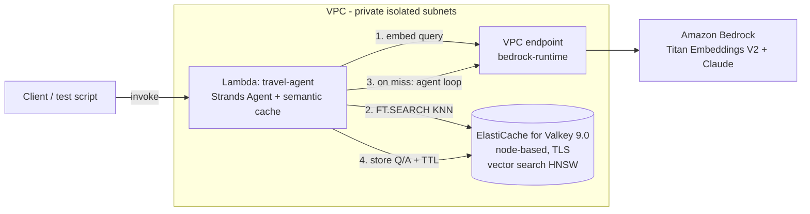

# Design — Semantic Cache for AI Agents with Amazon ElastiCache for Valkey

> This document explains the architecture before any code. Read it to understand
> what gets built, why each decision was made, and what can fail.

## Problem

AI agents receive many semantically similar questions ("What documents do I need to
travel to Japan?" / "Which papers are required for a trip to Japan?"). Without a
cache, every question triggers a full LLM invocation — paying for the same answer
again and again. Agent frameworks include prompt caching (which reduces input-token
cost but still generates every response) and conversation management, but no
**response cache**: a layer that returns a stored answer when a semantically
equivalent question was already answered.

## Solution

A semantic cache in front of the agent, backed by Amazon ElastiCache for Valkey
(version 9.0) using native vector search:

1. Embed the incoming question (Amazon Titan Text Embeddings V2, 1024 dims).
2. `FT.SEARCH` (KNN, HNSW, cosine) against previously answered questions.
3. **Hit** (similarity ≥ threshold): return the stored answer. Zero LLM tokens spent.
4. **Miss**: run the Strands agent, store (question, embedding, answer) with TTL.

A cache hit saves 100% of that invocation's tokens — input, output, and any
intermediate tool-calling steps of the agent loop.

## Architecture

Data flow per request: embed (1 Titan call, ~$0.00002) → KNN lookup (sub-ms) →
hit: return cached answer / miss: agent loop → store with TTL.

## Decisions and why

| Decision | Choice | Why |
|---|---|---|
| Cache store | ElastiCache for Valkey 9.0, **node-based** | Vector search requires node-based Valkey 8.2+; serverless does NOT support it (hard platform gate). 9.0 is AWS's recommended default and adds hash-field TTL. |
| Topology | 1 shard, no replicas, cluster mode off | Sample = smallest cost. Cluster mode off avoids hash-slot co-location constraints on `FT.SEARCH`. Production would add replicas + Multi-AZ. |
| Cache integration point | **Query-level** (before the agent runs) | A hit skips the entire agent loop — all input, output, and tool-call tokens. Same pattern AWS documents for semantic caching. A model-wrapper cache (inside the loop) is documented as a variation in the README. |
| Vector index | HNSW, COSINE, FLOAT32, DIM 1024 | Matches Titan V2 output. HNSW defaults (M=16) fine at sample scale. |
| FT.* access | `client.execute_command()` only | High-level search wrappers vary across client versions; raw commands are stable. Guarded by an `FT._LIST` probe (`supports_ft_search`) — never assume availability. |
| Key design | Dual key: `semcache:vec:<id>` (indexed hash: embedding + metadata) and `semcache:ans:<id>` (payload) | Keeps large answer payloads out of the HNSW index; both keys share TTL with jitter. |
| Hit threshold | cosine similarity ≥ 0.85 (configurable) | FAQ-style workload; strict enough to avoid wrong answers, tunable via env var. |
| Model scoping | Cached entries tagged with model id; lookup pre-filters by tag | An answer produced by model A is never served for model B (mirrors exact model-config matching in other frameworks' caches). |
| Embeddings | Titan Text Embeddings V2 via Bedrock | Managed, cheap, same as AWS's published semantic-cache benchmark setup. |
| Agent | Strands Agents travel assistant (FAQ-style) | FAQ traffic is the ideal semantic-cache workload: high repetition, factual answers. |
| Compute | Lambda ARM64, Python 3.13, inside the VPC | ElastiCache is VPC-only; Lambda is the cheapest always-off compute for a sample. |
| Bedrock access from VPC | Interface VPC endpoint (bedrock-runtime) | Private subnets need no NAT gateway (~$32/mo saved); endpoint ~$7/mo while deployed. |
| Networking | Private isolated subnets, SG-to-SG rule on 6379, TLS in transit | Least exposure; no public path to the cache. |
| Teardown | `RemovalPolicy.DESTROY` everywhere | `cdk destroy` must leave nothing behind (sample repo rule). |

## Token savings — the three levels (what the README teaches)

| Level | Mechanism | What it saves | Exists in the framework? |
|---|---|---|---|
| 1. Prompt caching | Bedrock cache points | Input-token cost on repeated prefixes; response still generated | Yes (built-in) |
| 2. Conversation management | Sliding window / summarization | History tokens re-sent per turn | Yes (built-in) |
| 3. **Semantic response cache** | This sample | **100% of the invocation on a hit** | **No — this is the gap** |

## Failure points and recovery

| Failure | Behavior |
|---|---|
| Cache unreachable / FT not supported | Fail open: log, run the agent normally. The cache is an optimization, never a dependency. |
| Index backfill in progress | `FT.CREATE` is idempotent-guarded; lookups before `state=ready` fall through to miss. |
| Embedding call fails | Fail open: skip cache, run agent. |
| Stale answers | TTL (default 24h) + jitter; `scope` tag allows per-model invalidation. |
| Wrong-answer risk (false hit) | Threshold starts strict (0.85); response includes `similarity` so tests can audit hits. |

## Observability

- Lambda structured logs: `cache_hit`, `similarity`, `tokens_saved`, latency ms.
- Strands `result.metrics.accumulated_usage` gives real token counts on misses;
  hits report the tokens the equivalent miss would have cost (measured from the
  original miss and stored with the entry).
- CloudWatch: ElastiCache CPU/memory + Lambda duration out of the box.

## Cost while deployed (us-east-1, approximate)

- ElastiCache `cache.t4g.small` ~ $0.045/hr (validated at deploy time with FT._LIST
  probe; escalate node size only if the engine rejects search on burstable nodes)
- bedrock-runtime interface endpoint ~ $0.01/hr/AZ
- Lambda: pay per invocation (pennies at sample scale)
- **Everything is destroyed by `cdk destroy` — no orphans.**

For current pricing see https://aws.amazon.com/elasticache/pricing/. For current
feature availability see https://docs.aws.amazon.com/AmazonElastiCache/latest/dg/.

## Deployment order

1. `cdk deploy` provisions VPC + endpoint + ElastiCache (~15 min) + Lambda.
2. Lambda creates the vector index lazily on first invocation (guarded, idempotent).
3. Test script sends paraphrased question pairs and reports hit ratio + tokens saved.
